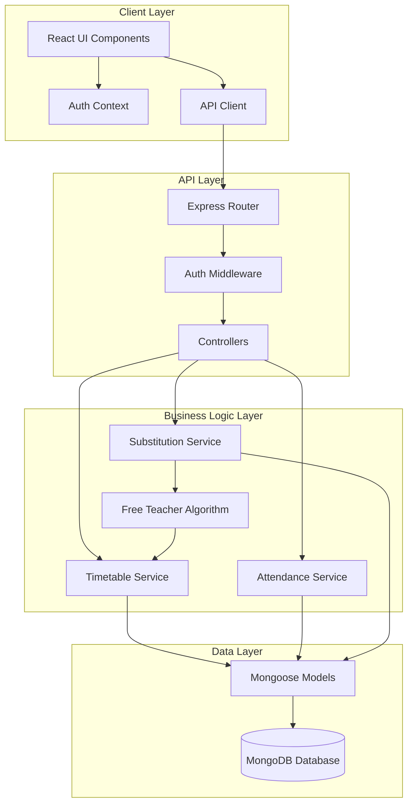
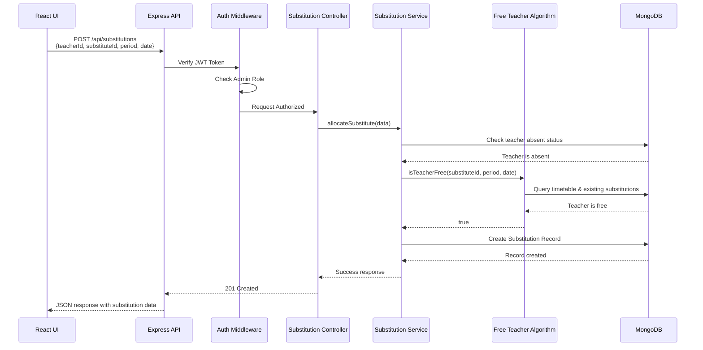
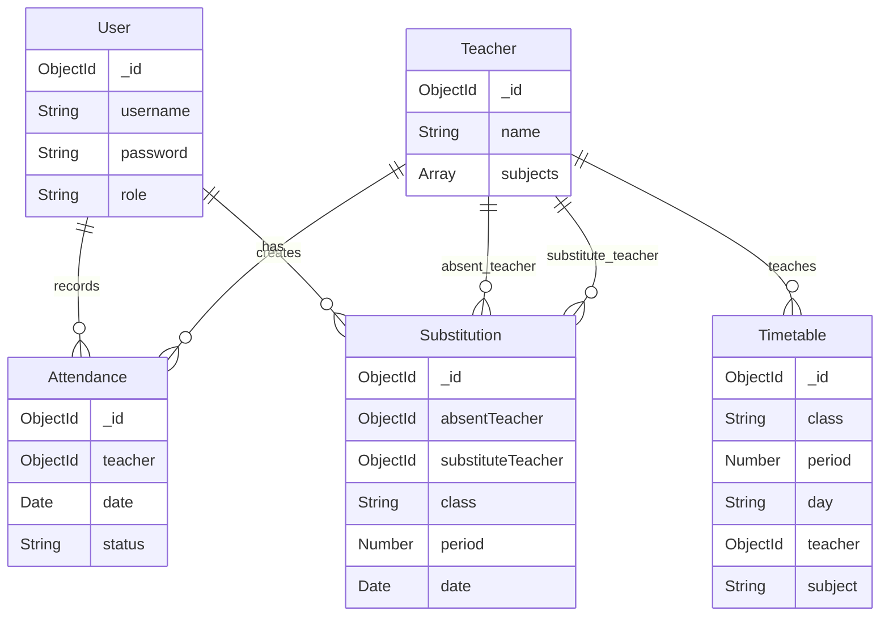

# Design Document: Teacher Attendance and Substitution Management System

## Overview

The Teacher Attendance and Substitution Management System is a full-stack MERN application that automates the daily workflow of tracking teacher attendance and allocating substitute teachers at Anuruddha Balika Vidyalaya. The system manages a complex timetable structure covering 16 classes (6A-13C), 8 instructional periods per day, plus special periods, across 5 school days per week.

### Core Capabilities

1. **Authentication & Authorization**: JWT-based authentication with role-based access control (Admin role)
2. **Timetable Management**: Store and query complex timetable data including combined classes and multiple teacher options
3. **Attendance Tracking**: Daily teacher attendance recording with historical viewing
4. **Free Teacher Identification**: Real-time algorithm to identify available substitute teachers
5. **Substitution Allocation**: Validate and assign substitute teachers to cover absent teachers' classes
6. **Data Import**: Bulk timetable import from JSON files

### Technology Stack

- **Frontend**: React with modern hooks-based components
- **Backend**: Node.js with Express.js RESTful API
- **Database**: MongoDB with Mongoose ODM
- **Authentication**: JWT (JSON Web Tokens) with bcrypt password hashing
- **Deployment**: Environment-based configuration for multiple deployment targets

## Architecture

### System Architecture Diagram



### Architectural Layers

#### 1. Client Layer (React Frontend)

**Responsibilities:**
- Render user interface components
- Manage client-side state (authentication context, form state)
- Make HTTP requests to backend API
- Handle user interactions and form validation
- Display loading states and error messages

**Key Components:**
- Authentication context provider for JWT token management
- Protected route wrapper for role-based access
- Dashboard components for attendance and substitution management
- Form components for data entry
- API client module with axios for HTTP communication

#### 2. API Layer (Express.js)

**Responsibilities:**
- Route HTTP requests to appropriate controllers
- Authenticate requests using JWT middleware
- Validate request payloads
- Handle CORS and security headers
- Return standardized JSON responses

**Key Modules:**
- Express router configuration
- JWT authentication middleware
- Request validation middleware
- Error handling middleware
- Controller functions for each resource

#### 3. Business Logic Layer

**Responsibilities:**
- Implement core business rules
- Execute complex queries and algorithms
- Validate business constraints
- Coordinate between multiple data models
- Transform data for API responses

**Key Services:**
- **TimetableService**: Query timetable by class, teacher, period, day
- **AttendanceService**: Record and retrieve attendance with date validation
- **SubstitutionService**: Create, update, and validate substitution assignments
- **FreeTeacherAlgorithm**: Identify available teachers excluding absent and already-assigned teachers

#### 4. Data Layer (MongoDB + Mongoose)

**Responsibilities:**
- Define data schemas and validation rules
- Provide database abstraction through Mongoose ODM
- Execute CRUD operations
- Maintain indexes for query performance
- Enforce referential integrity through schema design

**Key Models:**
- User, Teacher, Timetable, Attendance, Substitution

### Request Flow Example: Allocate Substitute Teacher



### Data Flow Patterns

**Read Operations:**
1. Client sends GET request with JWT token
2. Auth middleware validates token and role
3. Controller calls service method
4. Service queries MongoDB through Mongoose model
5. Service transforms data if needed
6. Controller returns JSON response

**Write Operations:**
1. Client sends POST/PUT request with JWT token and payload
2. Auth middleware validates token and role
3. Controller validates request payload
4. Controller calls service method
5. Service validates business rules
6. Service writes to MongoDB through Mongoose model
7. Service returns created/updated document
8. Controller returns JSON response with appropriate status code

## Components and Interfaces

### Backend API Endpoints

#### Authentication Endpoints

**POST /api/auth/login**
- **Purpose**: Authenticate user and issue JWT token
- **Request Body**:
  ```json
  {
    "username": "string",
    "password": "string"
  }
  ```
- **Response (200)**:
  ```json
  {
    "token": "string (JWT)",
    "user": {
      "id": "string",
      "username": "string",
      "role": "string"
    }
  }
  ```
- **Errors**: 400 (invalid input), 401 (invalid credentials)

**POST /api/auth/register** (Admin only)
- **Purpose**: Create new user account
- **Request Body**:
  ```json
  {
    "username": "string",
    "password": "string",
    "role": "string"
  }
  ```
- **Response (201)**: User object
- **Errors**: 400 (validation), 403 (unauthorized), 409 (username exists)

#### Teacher Endpoints

**GET /api/teachers**
- **Purpose**: Retrieve all teachers
- **Response (200)**:
  ```json
  [
    {
      "id": "string",
      "name": "string",
      "subjects": ["string"]
    }
  ]
  ```
- **Errors**: 500 (database error)

**POST /api/teachers** (Admin only)
- **Purpose**: Create new teacher
- **Request Body**:
  ```json
  {
    "name": "string",
    "subjects": ["string"]
  }
  ```
- **Response (201)**: Teacher object
- **Errors**: 400 (validation), 403 (unauthorized)

#### Timetable Endpoints

**GET /api/timetable**
- **Purpose**: Query timetable with filters
- **Query Parameters**:
  - `class`: Filter by class (e.g., "6A")
  - `teacher`: Filter by teacher ID
  - `day`: Filter by day (Monday-Friday)
  - `period`: Filter by period number (1-8)
- **Response (200)**:
  ```json
  [
    {
      "id": "string",
      "class": "string",
      "period": "number",
      "day": "string",
      "teacher": "string (ID)",
      "teacherName": "string",
      "subject": "string",
      "startTime": "string (HH:mm)",
      "endTime": "string (HH:mm)"
    }
  ]
  ```
- **Errors**: 400 (invalid query), 500 (database error)

**POST /api/timetable/import** (Admin only)
- **Purpose**: Bulk import timetable from JSON
- **Request Body**:
  ```json
  {
    "timetableData": [
      {
        "class": "string",
        "period": "number",
        "day": "string",
        "teacher": "string",
        "subject": "string",
        "startTime": "string",
        "endTime": "string"
      }
    ]
  }
  ```
- **Response (200)**:
  ```json
  {
    "imported": "number",
    "updated": "number",
    "errors": ["string"]
  }
  ```
- **Errors**: 400 (validation), 403 (unauthorized)

#### Attendance Endpoints

**POST /api/attendance** (Admin only)
- **Purpose**: Mark teacher attendance for a date
- **Request Body**:
  ```json
  {
    "teacherId": "string",
    "date": "string (ISO 8601)",
    "status": "present | absent"
  }
  ```
- **Response (201)**: Attendance record object
- **Errors**: 400 (validation), 403 (unauthorized)

**GET /api/attendance**
- **Purpose**: Retrieve attendance records
- **Query Parameters**:
  - `date`: Filter by specific date (ISO 8601)
  - `startDate`: Filter by date range start
  - `endDate`: Filter by date range end
  - `teacherId`: Filter by teacher
- **Response (200)**:
  ```json
  [
    {
      "id": "string",
      "teacherId": "string",
      "teacherName": "string",
      "date": "string (ISO 8601)",
      "status": "present | absent"
    }
  ]
  ```
- **Errors**: 400 (invalid query), 500 (database error)

**GET /api/attendance/date/:date**
- **Purpose**: Get all teacher attendance for specific date
- **Response (200)**: Array of attendance records
- **Errors**: 400 (invalid date), 500 (database error)

#### Substitution Endpoints

**POST /api/substitutions** (Admin only)
- **Purpose**: Allocate substitute teacher
- **Request Body**:
  ```json
  {
    "absentTeacherId": "string",
    "substituteTeacherId": "string",
    "class": "string",
    "period": "number",
    "date": "string (ISO 8601)",
    "subject": "string"
  }
  ```
- **Response (201)**: Substitution record object
- **Errors**: 400 (validation/business rule violation), 403 (unauthorized)

**GET /api/substitutions**
- **Purpose**: Retrieve substitution records
- **Query Parameters**:
  - `date`: Filter by date (ISO 8601)
  - `class`: Filter by class
  - `period`: Filter by period
- **Response (200)**:
  ```json
  [
    {
      "id": "string",
      "absentTeacherId": "string",
      "absentTeacherName": "string",
      "substituteTeacherId": "string",
      "substituteTeacherName": "string",
      "class": "string",
      "period": "number",
      "date": "string (ISO 8601)",
      "subject": "string"
    }
  ]
  ```
- **Errors**: 400 (invalid query), 500 (database error)

**PUT /api/substitutions/:id** (Admin only)
- **Purpose**: Update existing substitution assignment
- **Request Body**:
  ```json
  {
    "substituteTeacherId": "string"
  }
  ```
- **Response (200)**: Updated substitution record
- **Errors**: 400 (validation), 403 (unauthorized), 404 (not found)

**GET /api/substitutions/coverage/:teacherId/:date**
- **Purpose**: Get coverage status for absent teacher's periods
- **Response (200)**:
  ```json
  {
    "teacherId": "string",
    "teacherName": "string",
    "date": "string",
    "periods": [
      {
        "period": "number",
        "class": "string",
        "subject": "string",
        "hasCoverage": "boolean",
        "substituteTeacher": "string | null"
      }
    ],
    "coverageComplete": "boolean"
  }
  ```
- **Errors**: 400 (validation), 404 (teacher not found)

#### Free Teacher Endpoints

**GET /api/teachers/free**
- **Purpose**: Get list of available substitute teachers for a period
- **Query Parameters** (all required):
  - `period`: Period number (1-8)
  - `day`: Day of week (Monday-Friday)
  - `date`: Date (ISO 8601) for checking absence
- **Response (200)**:
  ```json
  [
    {
      "id": "string",
      "name": "string",
      "subjects": ["string"]
    }
  ]
  ```
- **Errors**: 400 (missing/invalid parameters), 500 (database error)

### Frontend Component Hierarchy

```
App
├── AuthProvider (Context)
├── Router
│   ├── LoginPage
│   ├── ProtectedRoute (HOC)
│   │   └── Dashboard
│   │       ├── Navigation
│   │       ├── AttendancePage
│   │       │   ├── AttendanceForm
│   │       │   │   ├── TeacherList
│   │       │   │   └── DatePicker
│   │       │   └── AttendanceHistory
│   │       ├── SubstitutionPage
│   │       │   ├── AbsentTeacherList
│   │       │   ├── PeriodCoverageView
│   │       │   ├── FreeTeacherList
│   │       │   ├── SubstitutionForm
│   │       │   └── SubstitutionSummary
│   │       ├── TimetablePage
│   │       │   ├── TimetableGrid
│   │       │   ├── TimetableFilters
│   │       │   └── TimetableImport
│   │       └── TeacherManagementPage
│   │           ├── TeacherList
│   │           └── TeacherForm
└── ErrorBoundary
```

### Key React Components

#### AuthProvider
- **Purpose**: Manage authentication state and JWT token
- **State**: `{ user, token, isAuthenticated, isLoading }`
- **Methods**: `login(username, password)`, `logout()`, `checkAuth()`
- **Context**: Provides auth state and methods to all child components

#### ProtectedRoute
- **Purpose**: Restrict access to authenticated admin users
- **Props**: `{ children, requiredRole }`
- **Behavior**: Redirect to login if not authenticated or wrong role

#### AttendanceForm
- **Purpose**: Mark daily teacher attendance
- **State**: `{ selectedDate, teacherStatuses, isSubmitting }`
- **Props**: `{ teachers, onSubmit }`
- **Events**: Handle date selection, toggle teacher status, submit attendance

#### FreeTeacherList
- **Purpose**: Display available substitute teachers for a period
- **Props**: `{ period, day, date, onSelectTeacher }`
- **State**: `{ freeTeachers, isLoading, error }`
- **Effects**: Fetch free teachers when period/day/date changes

#### SubstitutionForm
- **Purpose**: Allocate substitute teacher to cover absent teacher
- **Props**: `{ absentTeacher, period, class, date, onSubmit }`
- **State**: `{ selectedSubstitute, isSubmitting, error }`
- **Validation**: Ensure substitute teacher is selected before submission

#### PeriodCoverageView
- **Purpose**: Show which periods of absent teacher need coverage
- **Props**: `{ teacherId, date }`
- **State**: `{ coverageData, isLoading }`
- **Display**: Highlight uncovered periods, show assigned substitutes

### Service Layer Interfaces

#### TimetableService

```typescript
interface TimetableService {
  // Query timetable entries
  findByClass(className: string, day?: string): Promise<TimetableEntry[]>
  findByTeacher(teacherId: string, day?: string): Promise<TimetableEntry[]>
  findByPeriod(period: number, day: string): Promise<TimetableEntry[]>
  
  // Import operations
  bulkImport(entries: TimetableEntry[]): Promise<ImportResult>
  
  // Validation
  validateEntry(entry: TimetableEntry): ValidationResult
}
```

#### AttendanceService

```typescript
interface AttendanceService {
  // Record attendance
  markAttendance(teacherId: string, date: Date, status: 'present' | 'absent'): Promise<AttendanceRecord>
  
  // Query attendance
  getAttendanceByDate(date: Date): Promise<AttendanceRecord[]>
  getAttendanceByTeacher(teacherId: string, startDate: Date, endDate: Date): Promise<AttendanceRecord[]>
  
  // Check status
  isTeacherAbsent(teacherId: string, date: Date): Promise<boolean>
}
```

#### SubstitutionService

```typescript
interface SubstitutionService {
  // Allocate substitute
  allocateSubstitute(data: SubstitutionRequest): Promise<SubstitutionRecord>
  
  // Update substitute
  updateSubstitute(substitutionId: string, newSubstituteId: string): Promise<SubstitutionRecord>
  
  // Query substitutions
  getSubstitutionsByDate(date: Date): Promise<SubstitutionRecord[]>
  getSubstitutionsByClass(className: string, date: Date): Promise<SubstitutionRecord[]>
  
  // Coverage tracking
  getCoverageStatus(teacherId: string, date: Date): Promise<CoverageStatus>
  
  // Validation
  validateSubstitution(data: SubstitutionRequest): Promise<ValidationResult>
}
```

#### FreeTeacherAlgorithm

```typescript
interface FreeTeacherAlgorithm {
  // Find available teachers
  findFreeTeachers(period: number, day: string, date: Date): Promise<Teacher[]>
  
  // Check individual teacher availability
  isTeacherFree(teacherId: string, period: number, day: string, date: Date): Promise<boolean>
}
```

**Algorithm Logic:**
1. Get all teachers from database
2. Query timetable to find teachers scheduled for the given period and day
3. Query attendance to find teachers marked absent for the given date
4. Query substitutions to find teachers already assigned as substitutes for the period and date
5. Return teachers who are NOT in any of the above three lists

## Data Models

### MongoDB Collections and Schemas

#### User Collection

```javascript
{
  _id: ObjectId,
  username: String (required, unique, indexed),
  password: String (required, hashed with bcrypt),
  role: String (required, enum: ['admin', 'user']),
  createdAt: Date (default: Date.now),
  updatedAt: Date (default: Date.now)
}
```

**Indexes:**
- `username`: Unique index for login queries
- `role`: Index for role-based queries

**Validation:**
- Username: 3-50 characters, alphanumeric
- Password: Minimum 8 characters (enforced before hashing)
- Role: Must be 'admin' or 'user'

#### Teacher Collection

```javascript
{
  _id: ObjectId,
  name: String (required, indexed),
  subjects: [String] (required, array of subject names),
  createdAt: Date (default: Date.now),
  updatedAt: Date (default: Date.now)
}
```

**Indexes:**
- `name`: Index for teacher lookup and sorting

**Validation:**
- Name: 2-100 characters, required
- Subjects: Non-empty array, each subject 2-50 characters

#### Timetable Collection

```javascript
{
  _id: ObjectId,
  class: String (required, indexed),
  period: Number (required, 1-8),
  day: String (required, enum: ['Monday', 'Tuesday', 'Wednesday', 'Thursday', 'Friday']),
  teacher: ObjectId (required, ref: 'Teacher', indexed),
  subject: String (required),
  startTime: String (required, format: 'HH:mm'),
  endTime: String (required, format: 'HH:mm'),
  isCombinedClass: Boolean (default: false),
  alternateTeachers: [ObjectId] (optional, ref: 'Teacher'),
  createdAt: Date (default: Date.now),
  updatedAt: Date (default: Date.now)
}
```

**Indexes:**
- Compound index: `{ class: 1, day: 1, period: 1 }` for class schedule queries
- Compound index: `{ teacher: 1, day: 1, period: 1 }` for teacher schedule queries
- Compound index: `{ day: 1, period: 1 }` for period-based queries

**Validation:**
- Class: Must match pattern (6A-13C)
- Period: Integer 1-8
- Day: Must be weekday
- StartTime/EndTime: Must be valid 24-hour time format
- Teacher: Must reference existing Teacher document

**Unique Constraint:**
- Combination of `{ class, day, period }` should be unique (one entry per class-day-period)

#### Attendance Collection

```javascript
{
  _id: ObjectId,
  teacher: ObjectId (required, ref: 'Teacher', indexed),
  date: Date (required, indexed),
  status: String (required, enum: ['present', 'absent']),
  createdAt: Date (default: Date.now),
  updatedAt: Date (default: Date.now)
}
```

**Indexes:**
- Compound index: `{ teacher: 1, date: 1 }` (unique) for attendance lookup
- `date`: Index for date-based queries

**Validation:**
- Teacher: Must reference existing Teacher document
- Date: Must be valid date, stored as ISO 8601
- Status: Must be 'present' or 'absent'

**Unique Constraint:**
- Combination of `{ teacher, date }` must be unique (one attendance record per teacher per day)

#### Substitution Collection

```javascript
{
  _id: ObjectId,
  absentTeacher: ObjectId (required, ref: 'Teacher', indexed),
  substituteTeacher: ObjectId (required, ref: 'Teacher', indexed),
  class: String (required, indexed),
  period: Number (required, 1-8),
  date: Date (required, indexed),
  subject: String (required),
  createdAt: Date (default: Date.now),
  updatedAt: Date (default: Date.now)
}
```

**Indexes:**
- Compound index: `{ date: 1, period: 1 }` for daily substitution queries
- Compound index: `{ substituteTeacher: 1, date: 1, period: 1 }` for checking teacher availability
- Compound index: `{ absentTeacher: 1, date: 1 }` for coverage tracking
- `class`: Index for class-based queries

**Validation:**
- AbsentTeacher: Must reference existing Teacher document
- SubstituteTeacher: Must reference existing Teacher document
- Class: Must match pattern (6A-13C)
- Period: Integer 1-8
- Date: Must be valid date
- Subject: 2-50 characters

**Business Rule Constraints (enforced in application layer):**
- AbsentTeacher must be marked absent for the date
- SubstituteTeacher must be free (not scheduled) for the period and day
- SubstituteTeacher must not already be assigned as substitute for the same period and date

### Data Relationships



### Data Integrity Rules

1. **Referential Integrity:**
   - All teacher references in Timetable, Attendance, and Substitution must point to existing Teacher documents
   - Mongoose population will be used to resolve references
   - Deletion of Teacher should be restricted if referenced in active records

2. **Temporal Consistency:**
   - Attendance records must have valid dates
   - Substitution records must reference attendance records for the same date
   - Date validation ensures only school days (Monday-Friday) are used

3. **Business Logic Integrity:**
   - A teacher cannot be both absent and a substitute on the same day/period
   - A substitute teacher must be free (no timetable entry) for the assigned period
   - A teacher can only have one attendance status per day

4. **Uniqueness Constraints:**
   - One attendance record per teacher per day
   - One timetable entry per class per day per period
   - Username must be unique across all users


## Error Handling

### Error Handling Strategy

The system implements a layered error handling approach with consistent error responses across all API endpoints.

#### Error Response Format

All error responses follow a standardized JSON structure:

```json
{
  "success": false,
  "error": {
    "code": "ERROR_CODE",
    "message": "Human-readable error message",
    "details": {} // Optional additional context
  }
}
```

### Error Categories and HTTP Status Codes

#### 1. Validation Errors (400 Bad Request)

**Trigger Conditions:**
- Missing required fields in request body
- Invalid data types or formats
- Business rule violations (e.g., invalid class name, period out of range)
- Invalid date formats or weekend dates

**Example Response:**
```json
{
  "success": false,
  "error": {
    "code": "VALIDATION_ERROR",
    "message": "Invalid request data",
    "details": {
      "fields": {
        "period": "Period must be between 1 and 8",
        "date": "Date must be a weekday (Monday-Friday)"
      }
    }
  }
}
```

**Handling Approach:**
- Use Mongoose schema validation for data type and format checks
- Implement custom validation middleware for business rules
- Return specific field-level error messages
- Log validation errors at INFO level (not critical)

#### 2. Authentication Errors (401 Unauthorized)

**Trigger Conditions:**
- Missing JWT token in request headers
- Invalid or malformed JWT token
- Expired JWT token
- Invalid username/password combination

**Example Response:**
```json
{
  "success": false,
  "error": {
    "code": "AUTHENTICATION_FAILED",
    "message": "Invalid credentials"
  }
}
```

**Handling Approach:**
- Verify JWT token in authentication middleware
- Return generic error messages to prevent user enumeration
- Log authentication failures at WARN level
- Do not expose whether username or password was incorrect

#### 3. Authorization Errors (403 Forbidden)

**Trigger Conditions:**
- User lacks required role (non-admin accessing admin endpoints)
- User attempting to access resources they don't own

**Example Response:**
```json
{
  "success": false,
  "error": {
    "code": "FORBIDDEN",
    "message": "You do not have permission to perform this action"
  }
}
```

**Handling Approach:**
- Check user role in authorization middleware
- Return generic forbidden message
- Log authorization failures at WARN level with user ID and attempted action

#### 4. Resource Not Found Errors (404 Not Found)

**Trigger Conditions:**
- Requested teacher, timetable entry, or record does not exist
- Invalid resource ID in URL parameters

**Example Response:**
```json
{
  "success": false,
  "error": {
    "code": "NOT_FOUND",
    "message": "Teacher not found"
  }
}
```

**Handling Approach:**
- Check for null results from database queries
- Return specific resource type in error message
- Log at INFO level (expected behavior)

#### 5. Business Logic Errors (400 Bad Request or 409 Conflict)

**Trigger Conditions:**
- Attempting to allocate substitute teacher who is not free
- Attempting to allocate substitute for teacher not marked absent
- Attempting to create duplicate attendance record (handled as update)

**Example Response:**
```json
{
  "success": false,
  "error": {
    "code": "TEACHER_NOT_FREE",
    "message": "Selected teacher is not available during this period",
    "details": {
      "teacherId": "507f1f77bcf86cd799439011",
      "period": 3,
      "reason": "Teacher is scheduled to teach 10A during this period"
    }
  }
}
```

**Handling Approach:**
- Validate business rules in service layer before database operations
- Return descriptive error codes and messages
- Include context to help user understand and fix the issue
- Log at INFO level

#### 6. Database Errors (500 Internal Server Error)

**Trigger Conditions:**
- MongoDB connection failures
- Database query timeouts
- Constraint violations
- Unexpected database errors

**Example Response:**
```json
{
  "success": false,
  "error": {
    "code": "DATABASE_ERROR",
    "message": "An error occurred while processing your request. Please try again."
  }
}
```

**Handling Approach:**
- Catch all database errors in try-catch blocks
- Return generic error message to user (do not expose database details)
- Log full error stack trace at ERROR level with context
- Include request ID for troubleshooting

#### 7. Server Errors (500 Internal Server Error)

**Trigger Conditions:**
- Unhandled exceptions in application code
- Missing environment variables at startup
- File system errors during timetable import

**Example Response:**
```json
{
  "success": false,
  "error": {
    "code": "INTERNAL_ERROR",
    "message": "An unexpected error occurred. Please contact support."
  }
}
```

**Handling Approach:**
- Implement global error handler middleware
- Catch all unhandled errors
- Return generic error message
- Log full error details at ERROR level
- Alert monitoring system for critical errors

### Error Handling Implementation

#### Express Error Handling Middleware

```javascript
// Global error handler (last middleware in chain)
app.use((err, req, res, next) => {
  // Log error with context
  logger.error({
    message: err.message,
    stack: err.stack,
    url: req.url,
    method: req.method,
    userId: req.user?.id,
    timestamp: new Date().toISOString()
  });

  // Determine status code
  const statusCode = err.statusCode || 500;
  
  // Sanitize error message for production
  const message = process.env.NODE_ENV === 'production' && statusCode === 500
    ? 'An unexpected error occurred'
    : err.message;

  // Send error response
  res.status(statusCode).json({
    success: false,
    error: {
      code: err.code || 'INTERNAL_ERROR',
      message: message,
      ...(err.details && { details: err.details })
    }
  });
});
```

#### Service Layer Error Handling Pattern

```javascript
class SubstitutionService {
  async allocateSubstitute(data) {
    try {
      // Validate absent teacher is actually absent
      const isAbsent = await this.attendanceService.isTeacherAbsent(
        data.absentTeacherId,
        data.date
      );
      
      if (!isAbsent) {
        throw new BusinessError(
          'TEACHER_NOT_ABSENT',
          'Cannot allocate substitute for teacher who is not marked absent',
          { teacherId: data.absentTeacherId }
        );
      }

      // Validate substitute teacher is free
      const isFree = await this.freeTeacherAlgorithm.isTeacherFree(
        data.substituteTeacherId,
        data.period,
        data.day,
        data.date
      );
      
      if (!isFree) {
        throw new BusinessError(
          'TEACHER_NOT_FREE',
          'Selected teacher is not available during this period',
          { teacherId: data.substituteTeacherId, period: data.period }
        );
      }

      // Create substitution record
      const substitution = await Substitution.create(data);
      return substitution;
      
    } catch (error) {
      // Re-throw business errors
      if (error instanceof BusinessError) {
        throw error;
      }
      
      // Wrap database errors
      throw new DatabaseError(
        'Failed to allocate substitute teacher',
        error
      );
    }
  }
}
```

### Logging Strategy

#### Log Levels

- **ERROR**: System errors, database failures, unhandled exceptions
- **WARN**: Authentication failures, authorization denials, business rule violations
- **INFO**: Successful operations, validation errors, resource not found
- **DEBUG**: Detailed execution flow (development only)

#### Log Format

```json
{
  "timestamp": "2024-01-15T10:30:45.123Z",
  "level": "ERROR",
  "message": "Database connection failed",
  "context": {
    "operation": "allocateSubstitute",
    "userId": "507f1f77bcf86cd799439011",
    "requestId": "req-123-456",
    "error": {
      "message": "Connection timeout",
      "stack": "..."
    }
  }
}
```

#### Logging Implementation

- Use Winston or Pino for structured logging
- Log to console in development
- Log to file and/or external service (e.g., CloudWatch, Datadog) in production
- Include request ID for tracing requests across services
- Sanitize sensitive data (passwords, tokens) from logs

### Security Considerations

1. **Error Message Sanitization:**
   - Never expose database schema details
   - Never expose file system paths
   - Never expose stack traces in production
   - Use generic messages for authentication errors

2. **Rate Limiting:**
   - Implement rate limiting on authentication endpoints to prevent brute force attacks
   - Return 429 Too Many Requests after threshold

3. **Input Sanitization:**
   - Validate and sanitize all user inputs
   - Prevent NoSQL injection in MongoDB queries
   - Use parameterized queries through Mongoose

4. **Sensitive Data Protection:**
   - Never log passwords or tokens
   - Hash passwords before storage
   - Use environment variables for secrets

## Testing Strategy

### Testing Approach Overview

The Teacher Attendance and Substitution Management System requires a comprehensive testing strategy that covers unit tests, integration tests, and end-to-end tests. **Property-based testing is not the primary testing approach for this feature** because the system is primarily a CRUD application with database integration, API endpoints, and UI rendering—areas where example-based tests and integration tests are more appropriate.

### Why Property-Based Testing Is Not Applied

Property-based testing (PBT) is most effective for testing pure functions with universal properties across a wide input space. This system consists primarily of:

1. **Database CRUD Operations**: Creating, reading, updating attendance, substitutions, and timetable entries are integration concerns, not pure functions
2. **API Endpoints**: RESTful routes that interact with databases and external services
3. **UI Rendering**: React components that render based on state
4. **Authentication/Authorization**: JWT-based auth that depends on external libraries and database lookups

While there are some testable business logic components (e.g., free teacher algorithm, date validation), these are better served by:
- **Unit tests with example-based cases** for specific scenarios
- **Integration tests** to verify database interactions
- **End-to-end tests** to validate complete workflows

The few areas that could theoretically use PBT (date formatting, weekday validation) are simple enough that example-based tests with edge cases provide sufficient coverage without the overhead of 100+ randomized iterations.

### Testing Layers

#### 1. Unit Tests

**Purpose**: Test individual functions and components in isolation with mocked dependencies.

**Scope:**
- Service layer business logic
- Validation functions
- Utility functions (date formatting, time parsing)
- React component rendering and behavior

**Tools:**
- **Backend**: Jest with Supertest for API testing
- **Frontend**: Jest with React Testing Library
- **Mocking**: Jest mocks for database and external dependencies

**Key Test Cases:**

**Authentication Service:**
- Valid credentials return JWT token
- Invalid credentials return 401 error
- Password hashing is applied before storage
- Expired tokens are rejected

**Attendance Service:**
- Mark teacher present creates attendance record
- Mark teacher absent creates attendance record
- Duplicate attendance for same teacher/date updates existing record
- Query attendance by date returns all records
- Query attendance by teacher filters correctly

**Free Teacher Algorithm:**
- Returns teachers with no timetable entry for period
- Excludes teachers marked absent for date
- Excludes teachers already assigned as substitutes
- Returns empty list when no teachers are free
- Handles combined classes correctly

**Substitution Service:**
- Allocate substitute creates substitution record
- Rejects allocation if teacher not absent
- Rejects allocation if substitute not free
- Update substitution changes substitute teacher
- Query substitutions by date returns all records

**Date/Time Utilities:**
- Dates are stored in ISO 8601 format
- Times are stored in 24-hour format
- Weekday validation rejects Saturday and Sunday
- Weekday validation accepts Monday through Friday
- Date formatting produces human-readable output

**Timetable Service:**
- Query by class returns class schedule
- Query by teacher returns teacher schedule
- Query by period returns all classes for period
- Bulk import creates timetable entries
- Bulk import updates existing entries on duplicate
- Validation rejects entries with missing fields

**React Components:**
- AttendanceForm renders teacher list
- AttendanceForm submits correct data
- FreeTeacherList displays available teachers
- SubstitutionForm validates inputs before submission
- PeriodCoverageView highlights uncovered periods

**Test Coverage Target**: 80% code coverage for service layer and utility functions

#### 2. Integration Tests

**Purpose**: Test interactions between components, database operations, and API endpoints.

**Scope:**
- API endpoint request/response cycles
- Database read/write operations
- Authentication middleware
- Authorization middleware
- Error handling across layers

**Tools:**
- Jest with Supertest for API testing
- MongoDB Memory Server for in-memory database testing
- Mongoose for database operations

**Key Test Cases:**

**Authentication Endpoints:**
- POST /api/auth/login with valid credentials returns token
- POST /api/auth/login with invalid credentials returns 401
- POST /api/auth/register creates user (admin only)
- POST /api/auth/register without admin role returns 403

**Teacher Endpoints:**
- GET /api/teachers returns all teachers from database
- POST /api/teachers creates teacher in database
- POST /api/teachers without auth returns 401

**Timetable Endpoints:**
- GET /api/timetable with class filter returns class schedule
- GET /api/timetable with teacher filter returns teacher schedule
- POST /api/timetable/import creates entries in database
- POST /api/timetable/import with invalid data returns 400

**Attendance Endpoints:**
- POST /api/attendance creates attendance record in database
- POST /api/attendance with duplicate updates existing record
- GET /api/attendance with date filter returns records
- GET /api/attendance/date/:date returns all attendance for date

**Substitution Endpoints:**
- POST /api/substitutions creates substitution in database
- POST /api/substitutions with non-absent teacher returns 400
- POST /api/substitutions with busy substitute returns 400
- GET /api/substitutions with date filter returns records
- PUT /api/substitutions/:id updates substitution
- GET /api/substitutions/coverage/:teacherId/:date returns coverage status

**Free Teacher Endpoint:**
- GET /api/teachers/free returns available teachers
- GET /api/teachers/free excludes scheduled teachers
- GET /api/teachers/free excludes absent teachers
- GET /api/teachers/free excludes assigned substitutes

**Error Handling:**
- Database connection failure returns 500
- Invalid ObjectId returns 400
- Missing required fields returns 400 with validation details
- Unauthorized access returns 403

**Test Coverage Target**: All API endpoints tested with success and error cases

#### 3. End-to-End Tests

**Purpose**: Test complete user workflows from UI through backend to database.

**Scope:**
- User authentication flow
- Daily attendance marking workflow
- Substitute allocation workflow
- Timetable viewing and filtering
- Attendance history viewing

**Tools:**
- Cypress or Playwright for browser automation
- Test database with seed data

**Key Test Scenarios:**

**User Authentication:**
1. Navigate to login page
2. Enter valid credentials
3. Verify redirect to dashboard
4. Verify JWT token stored in localStorage
5. Logout and verify redirect to login

**Mark Daily Attendance:**
1. Login as admin
2. Navigate to attendance page
3. Select current date
4. Mark teachers as present/absent
5. Submit attendance
6. Verify success message
7. Verify attendance saved (refresh page)

**Allocate Substitute Teacher:**
1. Login as admin
2. Navigate to substitution page
3. Select date with absent teachers
4. View absent teacher's schedule
5. Select period needing coverage
6. View free teachers for period
7. Select substitute teacher
8. Submit substitution
9. Verify success message
10. Verify substitution appears in summary

**View Timetable:**
1. Login as admin
2. Navigate to timetable page
3. Filter by class
4. Verify class schedule displayed
5. Filter by teacher
6. Verify teacher schedule displayed

**View Attendance History:**
1. Login as admin
2. Navigate to attendance history
3. Select date range
4. Filter by teacher
5. Verify attendance records displayed

**Test Coverage Target**: All critical user workflows tested

#### 4. Database Tests

**Purpose**: Verify database schema, indexes, and constraints.

**Scope:**
- Schema validation
- Unique constraints
- Referential integrity
- Index performance

**Key Test Cases:**

**Schema Validation:**
- User schema requires username, password, role
- Teacher schema requires name, subjects
- Timetable schema requires class, period, day, teacher, subject
- Attendance schema requires teacher, date, status
- Substitution schema requires all fields

**Unique Constraints:**
- Username is unique across users
- Teacher-date combination is unique in attendance
- Class-day-period combination is unique in timetable

**Referential Integrity:**
- Timetable teacher references Teacher collection
- Attendance teacher references Teacher collection
- Substitution absentTeacher references Teacher collection
- Substitution substituteTeacher references Teacher collection

**Indexes:**
- Verify indexes exist on frequently queried fields
- Measure query performance with indexes

### Test Data Management

**Seed Data:**
- Create seed data for teachers (20-30 teachers with various subjects)
- Create seed data for timetable (complete schedule for all classes)
- Create seed data for users (admin and regular user accounts)

**Test Data Generation:**
- Use factories or fixtures for consistent test data
- Generate realistic data (valid class names, periods, dates)
- Clean up test data after each test suite

**Database State:**
- Use MongoDB Memory Server for isolated unit/integration tests
- Use separate test database for E2E tests
- Reset database state before each test

### Continuous Integration

**CI Pipeline:**
1. Run linter (ESLint) on all code
2. Run unit tests with coverage report
3. Run integration tests
4. Run E2E tests (on staging environment)
5. Generate coverage report
6. Fail build if coverage below 80%

**Pre-commit Hooks:**
- Run linter on staged files
- Run unit tests for changed files
- Prevent commit if tests fail

### Manual Testing Checklist

**Before Release:**
- [ ] Test on multiple browsers (Chrome, Firefox, Safari)
- [ ] Test on different screen sizes (desktop, tablet, mobile)
- [ ] Test with slow network connection
- [ ] Test with database connection failures
- [ ] Test with expired JWT tokens
- [ ] Verify error messages are user-friendly
- [ ] Verify no sensitive data in error messages
- [ ] Test bulk timetable import with large files
- [ ] Test with maximum number of teachers and classes
- [ ] Verify logging is working correctly

### Performance Testing

**Load Testing:**
- Test API endpoints with concurrent requests
- Measure response times under load
- Identify bottlenecks in database queries
- Optimize slow queries with indexes

**Stress Testing:**
- Test with maximum number of teachers (100+)
- Test with complete timetable data (16 classes × 8 periods × 5 days)
- Test bulk import with large JSON files (1000+ entries)

**Performance Targets:**
- API response time < 200ms for simple queries
- API response time < 500ms for complex queries (free teacher algorithm)
- Page load time < 2 seconds
- Time to interactive < 3 seconds

### Security Testing

**Authentication Testing:**
- Test with invalid JWT tokens
- Test with expired JWT tokens
- Test with missing authorization headers
- Test password hashing (verify bcrypt is used)

**Authorization Testing:**
- Test non-admin access to admin endpoints
- Verify 403 responses for unauthorized access

**Input Validation Testing:**
- Test with SQL injection attempts (NoSQL injection)
- Test with XSS payloads in text fields
- Test with extremely long inputs
- Test with special characters

**Security Checklist:**
- [ ] Passwords are hashed with bcrypt
- [ ] JWT secrets are stored in environment variables
- [ ] Error messages don't expose sensitive information
- [ ] Rate limiting is implemented on auth endpoints
- [ ] CORS is configured correctly
- [ ] HTTPS is enforced in production

---

## Summary

This design document provides a comprehensive technical blueprint for implementing the Teacher Attendance and Substitution Management System. The architecture follows a layered approach with clear separation of concerns:

- **Client Layer**: React-based UI with authentication context and API client
- **API Layer**: Express.js RESTful endpoints with JWT authentication
- **Business Logic Layer**: Service classes implementing core algorithms and validation
- **Data Layer**: MongoDB with Mongoose ODM for data persistence

Key design decisions include:
- JWT-based authentication for stateless sessions
- Role-based access control with admin privileges
- Comprehensive error handling with standardized responses
- Free teacher algorithm that excludes scheduled, absent, and assigned teachers
- Flexible timetable structure supporting combined classes and alternate teachers
- Testing strategy focused on unit tests, integration tests, and E2E tests (PBT not applied due to CRUD-heavy nature)

The system is designed for maintainability, scalability, and ease of deployment across different environments through environment-based configuration.


